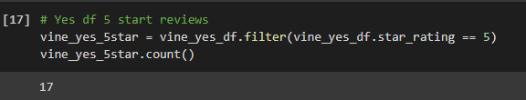
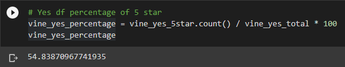
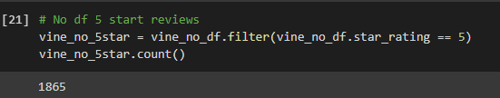
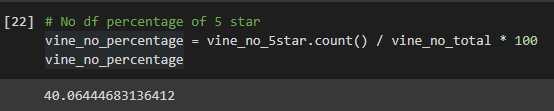

# **Amazon Vine Analysis**

## **Overview of Analysis**

This analysis was conducted to determine if enrolling products into the Amazon Vine Review program affected the total percentage of 5 star reviews. The category of product reviews used was Major Applicances.

### Resources
- amazon_reviews_us_Major_Appliances_v1_00.tsv.gz
---
## **Results**

### VINE REVIEWS
- There were a total of **31** Vine reviews for this category.

- There were a total of **17** 5-star Vine reviews for this category.

- The percentage of 5-star Vine reviews was **54.84**

### NON-VINE REVIEWS
- There were a total of **4655** non-Vine reviews for this category.

- There were a total of **1865** 5-star non-Vine reviews for this category.

- The percentage of 5-star non-Vine reviews was **40.1**

---

## **Summary**

The percentage of 5-star reviews was definitely higher for the Vine reviews. The difference between Vine and non-Vine 5-star reviews was almost 15 percent (54.84 - 40.1 = 14.74).

### Addtional Analysis

More analysis could be run on 4-star reviews, as well. As these reviews are generally accepted as positive by shoppers, this could significantly increase the positive ratings (and therefore perception) of the product.